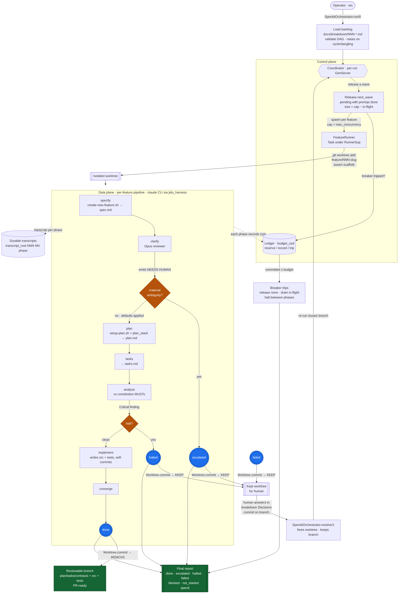

# Autonomous workflow

End-to-end flow of the `speckit_orchestrator` autonomous, spec-driven build
pipeline: operator → control plane (Coordinator + Ledger) → per-feature data
plane (the 7-phase Spec Kit pipeline) → terminals → human-resolve loop.

## Reading it

- **Control plane** (`Coordinator` + `Ledger`) is pure orchestration: it releases
  features in dependency-and-cap **waves**, records cost per phase, and trips the
  **breaker** at `budget_usd` (drain-don't-kill — in-flight features finish their
  current phase then halt).
- **Data plane** is the Spec Kit loop run through the `claude` CLI, one phase per
  fresh `claude -p` session, in an isolated **git worktree** per feature.
- **Two gates** divert the linear pipeline: `clarify` escalates on a *material*
  `## NEEDS HUMAN` (→ `escalated`); `analyze` halts on a Critical constitution
  violation (→ `halted`).
- **Terminals commit before teardown.** `:done` commits the generated branch then
  removes the worktree; `escalated`/`halted`/`failed` commit then **keep** the
  worktree. Transcripts are written to a **durable** root that survives teardown.
- **Human-resolve loop.** For a kept feature, answer the escalation in the
  breakdown's `## Decisions` (specify regenerates the spec from it), commit on the
  branch, `resolve/1` to free the worktree, and re-run — the feature reuses its
  branch. Escalations can span multiple rounds.

See `docs/runbook.md` for the operator step-by-step and
`docs/speckit-orchestrator-implementation-plan.md` for scope and rationale.
