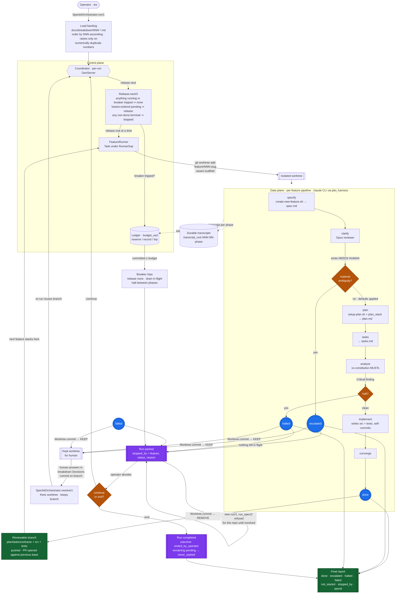

# Autonomous workflow

End-to-end flow of the `speckit_orchestrator` autonomous, spec-driven build
pipeline: operator → control plane (Coordinator + Ledger) → per-feature data
plane (the 7-phase Spec Kit pipeline) → terminals → human-resolve loop, or the
park/continue/end loop when the chain itself breaks.

Every run is a **stacked sequential run** — there is no other shape. One
feature builds at a time, in ascending numeric order (the `NNN` in its
filename), each branching from the previous completed feature's branch and
published as a PR against that base. There is no concurrency setting and no
dependency declaration to configure; a `## Prerequisites` section in a
breakdown file is inert prose.

```mermaid
flowchart TB
  OP([Operator · iex]) -->|SpeckitOrchestrator.run/1| BL[Load backlog<br/>docs/breakdown/NNN-*.md<br/>order by NNN ascending · raises only on<br/>numerically duplicate numbers]
  BL --> CO{{Coordinator · per-run GenServer}}

  subgraph CTRL[Control plane]
    direction TB
    CO -->|release next| REL[Release.next/3<br/>anything running or breaker tripped ⇒ none<br/>lowest-ordered pending ⇒ release<br/>any non-done terminal ⇒ stopped]
    REL -->|breaker tripped?| LED[(Ledger · budget_usd<br/>reserve / record / trip)]
    REL -->|release one at a time| RUN[FeatureRunner<br/>Task under RunnerSup]
  end

  RUN -->|git worktree add<br/>feature/NNN-slug<br/>assert scaffold| WT[[Isolated worktree]]
  WT --> PIPE

  subgraph PIPE[Data plane · per-feature pipeline · claude CLI via jido_harness]
    direction TB
    SP[specify<br/>create-new-feature.sh → spec.md] --> CL[clarify<br/>Opus reviewer]
    CL -->|emits NEEDS HUMAN| GESC{material<br/>ambiguity?}
    GESC -->|yes| ESC(((escalated)))
    GESC -->|no · defaults applied| PL[plan<br/>setup-plan.sh + plan_stack → plan.md]
    PL --> TK[tasks<br/>→ tasks.md]
    TK --> AN[analyze<br/>vs constitution MUSTs]
    AN -->|Critical finding| GHALT{halt?}
    GHALT -->|yes| HALT(((halted)))
    GHALT -->|clean| IM[implement<br/>writes src + tests, self-commits]
    IM --> CV[converge] --> DONE(((done)))
  end

  PIPE -.each phase records cost.-> LED
  PIPE -.transcript per phase.-> TR[(Durable transcripts<br/>transcript_root NNN NN-phase)]

  DONE -->|Worktree.commit → REMOVE| BR[Reviewable branch<br/>plan/tasks/contracts + src + tests<br/>pushed · PR opened against previous base]
  BR -->|next feature stacks here| RUN
  ESC -->|Worktree.commit → KEEP| KEPT[[Kept worktree<br/>for human]]
  HALT -->|Worktree.commit → KEEP| KEPT
  FAIL(((failed))) -->|Worktree.commit → KEEP| KEPT

  KEPT -->|human answers in<br/>breakdown Decisions<br/>commit on branch| RES[SpeckitOrchestrator.resolve/1<br/>frees worktree · keeps branch]
  RES -->|re-run reuses branch| CO

  ESC -->|nothing left in flight| PARK[[Run parked<br/>stopped_by = feature, status, reason]]
  HALT --> PARK
  FAIL --> PARK
  PARK -->|new run/1, run_spec/2 refused<br/>for this repo until resolved| PARK
  PARK -->|operator decides| DEC{continue<br/>or end?}
  DEC -->|:continue| CO
  DEC -->|:end| ENDR[[Run completed<br/>outcome: ended_by_operator<br/>remaining pending → never_started]]

  LED -->|committed ≥ budget| BRK[Breaker trips<br/>release none · drain in-flight<br/>halt between phases]
  BRK --> PARK
  DONE --> REP[[Final report<br/>done · escalated · halted · failed<br/>not_started · stopped_by · spend]]
  ESC --> REP
  HALT --> REP
  ENDR --> REP

  classDef term fill:#1f6feb,stroke:#0b3d91,color:#fff;
  classDef gate fill:#b45309,stroke:#7c2d12,color:#fff;
  classDef sink fill:#166534,stroke:#052e16,color:#fff;
  classDef park fill:#7c3aed,stroke:#4c1d95,color:#fff;
  class ESC,HALT,DONE,FAIL term;
  class GESC,GHALT,DEC gate;
  class BR,REP sink;
  class PARK,ENDR park;
```

## Reading it

- **Control plane** (`Coordinator` + `Ledger`) is pure orchestration:
  `Release.next/3` releases exactly one feature at a time, in ascending
  numeric order, records cost per phase, and trips the **breaker** at
  `budget_usd` (drain-don't-kill — the in-flight feature finishes its current
  phase then halts). One-feature-at-a-time is a structural property of
  `Release.next/3` (rule: anything `:running` ⇒ release nothing), not a
  configured cap — there is no concurrency setting anywhere.
- **Data plane** is the Spec Kit loop run through the `claude` CLI, one phase
  per fresh `claude -p` session, in an isolated **git worktree** per feature.
- **Two gates** divert the linear pipeline: `clarify` escalates on a *material*
  `## NEEDS HUMAN` (→ `escalated`) — no run setting can wave that one through;
  `analyze` halts on a Critical constitution violation (→ `halted`) and
  escalates on a High finding (→ `escalated`) when the run's severity threshold
  is High or lower.
- **Auto-remediation loop, and what happens when it runs out.** Before the
  analyze gate decides, a bounded corrective loop (feature 017) may retry
  findings at or above the threshold, up to a per-run attempt limit (default
  2). On exhaustion the gate reads the run's **exhaustion policy** (feature
  021, `auto_remediation_exhaustion_policy`, default `:escalate`): `:escalate`
  reproduces today's outcome exactly; `:proceed` advances the feature past a
  residual finding instead of diverting, and records what it advanced past on
  the run's report, the console, and the feature's PR body, so the PR reviewer
  sees it. Constitution 4.0.0 governs Critical by that same policy: no
  threshold reaches a Critical (it is the ceiling of the severity order), and
  only an exhausted loop plus an explicit `:proceed` advances past one — the
  default (`:escalate`), a loop that is off, and a loop with attempts left all
  still halt.
- **Terminals commit before teardown.** `:done` commits the generated branch,
  pushes it, and opens a PR against the previous feature's branch (or
  `pr_base` for the first), then removes the worktree; `escalated`/`halted`/
  `failed` commit then **keep** the worktree. Transcripts are written to a
  **durable** root that survives teardown.
- **A broken link stops the chain.** As soon as a feature reaches a
  non-`:done` terminal state and nothing else is in flight, `Release.next/3`
  reports `{:stopped, id, status}` instead of an empty wave that looks the
  same as "backlog exhausted." The Coordinator **parks** the run
  (`Store.Writer.park_run/2`), records `stopped_by`, and refuses any new
  `run/1`/`run_spec/2` for that repository until the operator resolves it.
- **Human-resolve loop** (fixing the stopping feature itself). Answer the
  escalation in the breakdown's `## Decisions` (specify regenerates the spec
  from it), commit on the branch, then resolve with an explicit decision.
- **Park/continue/end loop** (deciding what the *run* does next).
  `resolve(id, decision: :continue)` flips the run back to `:in_flight`,
  resets the stopping feature to `:pending`, and resumes the chain in order
  from there. `resolve(id, decision: :end)` closes the run out —
  `outcome: :ended_by_operator`, every still-`:pending` feature recorded
  `:never_started` — and releases nothing further. Absent a decision, both
  facade entry points refuse to guess.

## Retired settings are refused, not ignored

There is no `pr_workflow` toggle and no `max_concurrency` setting — this
*is* the only run shape. Both are refused loudly at three independent edges,
because each is read at a different time:

- `config/runtime.exs` raises at config load if `SPECKIT_PR_WORKFLOW` or
  `SPECKIT_MAX_CONCURRENCY` is set at all.
- `Application.start/2` aborts boot if either app-env key is present.
- `run/1`, `run_spec/2`, `resume/2`, `resume_run/1` refuse either key as a
  run-start option with `{:error, {:preflight, [{:retired_option, key}]}}`,
  before any side effect.

See `docs/runbook.md` → "Parked runs" for the operator step-by-step and
`docs/speckit-orchestrator-implementation-plan.md` for scope and rationale.
